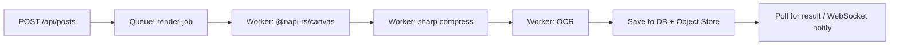

# Croquia — Vision & Evolution

> *"Letters in your own hand, written for one person at a time."*

---

## ⚠ Course Correction — June 2026

This document predates [ASSESSMENT.md](./ASSESSMENT.md), which is now the operative roadmap. The reframe: **Croquia is correspondence-first, not Instagram-for-handwriting.** The inbox, 1:1 letters, reply chains, and the **Letter Exchange** (pair two strangers, each writes the other a letter) are the product; the public feed is the lobby, not the building.

Status of the sections below:

- **§1 (Core Identity), §2 (Canvas), §5 (Experience Layers)** — still the soul of the product. Build from here.
- **§3 (Stamps Economy)** — **dropped as an economy.** Stamps survived as the *single* reaction with a free daily allowance (no rarity tiers, no scarcity, no burning, no anti-farming). Stamp *designs* may return later as cosmetic collectibles only.
- **§4 (Instagram-Like Feed)** — **dropped.** No vertical swipe feed, no CLIP embeddings, no auto-scroll. Envelopes on a table is the genre.
- **§6 (Cloud & Scaling), §7.2–7.3 (queues, feed perf)** — **parked as someday-reference.** Until ~5k users the entire infra story is one small VPS + S3-compatible storage + Cloudflare, at $20–50/month.
- **§8 roadmap** — superseded by the kanban in ASSESSMENT.md.

---

## Table of Contents

1. [Core Identity](#1-core-identity)
2. [The Letter-Writing Canvas (UX Overhaul)](#2-the-letter-writing-canvas-ux-overhaul)
3. [Stamps Economy](#3-stamps-economy)
4. [Instagram-Like Feed & Discovery](#4-instagram-like-feed--discovery)
5. [Unique Experience Layers](#5-unique-experience-layers)
6. [Cloud Provider & Scaling Strategy](#6-cloud-provider--scaling-strategy)
7. [Architecture Evolution](#7-architecture-evolution)
8. [Phased Roadmap](#8-phased-roadmap)

---

## 1. Core Identity

### The Emotional North Star

Every design decision should answer: *"Does this make the person feel like they're writing (or receiving) a real letter?"*

**Existing project DNA (preserve):**
- No text input anywhere — drawing-only authentication (username is the single exception, keep it)
- Canvas/photos as the only input mode
- Paper textures, ink styles, serif typography
- Magic link auth (no passwords to type)
- OCR-based hashtag discovery
- Scratch overlays (graffiti on posts)

**Fresh direction:**

| Old Paradigm | New Paradigm |
|---|---|
| "Create a post" | "Write a letter" |
| "Feed" | "Postbox" or "Mailbag" |
| "Like / Dislike" | "Stamp of approval / Send back" |
| "Profile" | "Desk / Studio" |
| "Username" | "Signature" |
| "Scratch" | "Marginalia" |
| "Groups" | "Circles / Correspondences" |
| "Explore" | "Open mail" / "Common room" |

---

## 2. The Letter-Writing Canvas (UX Overhaul)

### 2.1 Canvas Resize & Aspect Ratio

**Current:** 2400x3200 (roughly 3:4 portrait)

**Proposed:** 2550x3300 (standard A4 letter proportions at 300dpi)

The canvas should feel like a physical piece of paper, not a digital canvas. Key changes:

- **A4/Letter aspect ratio** — the most universally recognized paper shape
- **Physical border** — render a subtle paper edge shadow, corner curl, or deckled edge
- **Canvas padding/margins** — enforce a ~5% margin zone where ink fades to indicate "edge of paper"
- **Orientation toggle** — portrait (letter) vs landscape (postcard) for different vibes

### 2.2 Letter-Writing Metaphor

Replace the current toolbars with elements that evoke a real desk:

**"Stationery drawer" (replacing paper chooser):**
- Vellum, laid paper, parchment, airmail (blue tissue), graph (engineering paper), black construction paper (for chalk/white ink), recycled brown paper, Japanese washi patterns
- Each stationery has a subtle watermark visible at certain angles
- **Personal stationery**: Earn or design your own letterhead (your nom de plume becomes a watermark)

**"Pen box" (replacing ink chooser):**
- Fountain pen (variable width based on pressure, wet ink flow)
- Ballpoint (consistent thin line, slight skipping on fast strokes)
- Brush pen (wide expressive strokes, pressure-sensitive)
- Dip pen (scratchy, ink splatter at the start of strokes)
- Pencil (#2 graphite, erasable — the only stroke you can undo)

**Ink colors replace with "ink bottles":**
- Keep current 10 colors but present them as little glass inkwell bottles with a drip animation
- **Vintage colors**: Iron gall (fades to brown over days), sepia, crimson, indigo, emerald, violet, gold leaf (simulated)

### 2.3 Envelope View (The "Seal" Moment)

When the user finishes drawing, add an **envelope preview** step:

1. User draws their letter (the canvas content)
2. They enter the "Seal and Send" flow
3. A new screen shows their letter **folded inside an envelope** (animated fold)
4. They can draw a stamp placement and wax seal on the envelope
5. The envelope preview is what appears in the feed (not the full letter)
6. Clicking the envelope in the feed "opens" it with an unseal animation, revealing the full letter

This is the single biggest visual differentiator. Every post becomes a piece of mail.

### 2.4 Pressure & Stroke Enhancements

**Current:** Records pressure, simulates ink effects with seeded randomness

**Add:**
- **Real-time ink pooling**: Where strokes overlap, ink darkens and pools (use composite operations)
- **Drying time**: Freshly drawn strokes render slightly glossy (simulated wet ink); after 5 seconds offline they dry (matte)
- **Smudge support**: Touch/palm rejection should leave subtle graphite smudges for pencil mode
- **Speed sensitivity**: Fast strokes are thinner and lighter; slow strokes pool more ink
- **Pen tilt support**: For Apple Pencil/Stylus — use `tiltX`/`tiltY` to vary nib width (calligraphy mode gets much more realistic)

### 2.5 Signature Authentication

When "sealing and sending" a letter, the user draws their **handwritten signature** once. This signature becomes:

1. The bottom of every letter they send
2. A biometric-like verification that the post is truly theirs (no copy-paste of someone else's art)
3. The signature is stored as stroke data and re-rendered at the bottom of each letter (like a real signature block)

---

## 3. Stamps Economy

### 3.1 Conceptual Design

In postal history, stamps are prepaid proof of postage. In Croquia, stamps are:

- **A unit of social currency** — you earn stamps by creating quality handwritten content
- **A method of "mittance"** (remittance) — sending stamps to another user is like sending them a small gift/value
- **Scarce & tradeable** — different stamps are issued weekly/seasonally with limited supply
- **Visually beautiful** — each stamp is a tiny hand-illustrated artwork

### 3.2 How Stamps Work

**Earning Stamps:**
- Baseline: Every post you create earns you 1 stamp
- Engagement bonus: +1 stamp for every 10 likes your post gets
- Streak bonus: Post every day for a week? Earn a rare "consistency" stamp
- Discovery bonus: +2 stamps on your first post that gets scratched by someone else
- Referral: When someone joins via your referral link, you earn 3 stamps

**Spending Stamps — "Mittance":**
The user mentioned "mittance" (remittance — sending value to someone). This is the core economic action:

- **Send a stamp** to another user's post as a reward (like a super-like): 1 stamp
- **"Postage-paid reply"**: Spend 2 stamps to guarantee your reply letter appears at the top of the recipient's feed next time they open the app
- **"Wax seal premium"**: Spend 3 stamps to add an animated wax seal to your letter
- **"Priority mail"**: Spend 5 stamps to have your letter delivered instantly (bypasses the chronological feed delay)
- **Gift stamps**: Send stamps directly to another user (no message, just the act of giving)

**Rarity Tiers:**
| Tier | Distribution | How to Get | Visual |
|---|---|---|---|
| Common (blue) | Unlimited | Post creation | Simple geometric stamp |
| Uncommon (silver) | 1000/week | Streak/engagement milestones | Illustrated flower/leaf |
| Rare (gold) | 100/week | First scratcher on a viral post | Animal illustration |
| Epic (purple) | 50 total, one-time | Monthly contest winner | Full illustration by community artist |
| Legendary (red) | 1 total, one-time | Platform milestones (1M posts) | Hand-drawn by the founder |

### 3.3 Stamp Gallery (Philately)

Each user has a **Stamp Book** on their profile showing:
- All stamps they've earned (with issue date, scarcity badge)
- Stamps they've sent to others (as "sent mail" record)
- Stamps they've received from others (as "gifts")
- Completion percentage for the current season's stamp collection

Seasons (monthly): A themed set of 10 stamps. Collect all 10 in a season to get a unique "album completion" stamp for the next season.

### 3.4 Anti-Farming Mechanics

To prevent stamp farming:
- Posts must have minimum 30 seconds of actual drawing time (up from 15s)
- Stamps earned cap: Max 10 stamps per day from engagement (uncapped from posting)
- Algorithmic detection: If stroke data looks like scribble noise (low curvature, uniform speed across 5+ posts), flag and temporarily suspend stamp rewards
- Stamps sent to others are **burned** (they leave your stamp book and enter the recipient's — they're removed from the economy)

---

## 4. Instagram-Like Feed & Discovery

### 4.1 "The Postbox" — Primary Feed

**Current:** Chronological column of posts with a "Load more" button. Works but doesn't feel rich.

**Proposed (Instagram-like):**

- **Full-screen vertical swipe** (like Instagram Stories + Feed hybrid)
- Each item fills most of the viewport
- The letter/envelope is shown in its full detail
- Swipe up/down to navigate between letters
- Double-tap to "Stamp" (the equivalent of like, costs 1 stamp)

**Feed layout per card:**

```
┌─────────────────────────┐
│  [Author picture] InkSage  ·  2h ago  │
├─────────────────────────┤
│                         │
│  ┌─────────────────┐    │
│  │                 │    │
│  │   THE LETTER    │    │
│  │  (full photo)   │    │
│  │                 │    │
│  │  [signature]    │    │
│  └─────────────────┘    │
│                         │
├─────────────────────────┤
│  ⭐ 42 stamps  ✉️ 12    │  ← interactions row
│  #poetry #handwriting   │
└─────────────────────────┘
```

### 4.2 Feed Interactions (Stamp-Based)

Replace like/dislike with stamp-centric interactions:

| New Action | Feels Like | Cost |
|---|---|---|
| **Stamp** (⭐) | "This letter was worth reading" | 1 stamp (from your wallet) |
| **Reply** (✉️) | "I'll write you back" | Free (creates a new post connected to the original) |
| **Marginalia** (🖊️) | Scribble on someone's letter (replaces Scratch) | Free |
| **Pass Along** (🔄) | "Forward this to your followers" | 1 stamp |
| **Treasury** (📦) | Save to your private collection | Free |
| **Flag** (🚩) | "This isn't handwritten / is AI-generated slop" | Free (cost to falsely flag: reputation) |

The stamp count on a post replaces the "like count" as the primary status metric. Posts with zero stamps after 24h naturally fade from feeds.

### 4.3 "Open Mail" — Explore Tab

An infinite-scroll masonry grid like Pinterest/Instagram Explore:
- Full-viewport, 2-3 column responsive grid
- Shows envelope previews (the sealed view) — intriguing, not revealing
- Sorted by a blend of: recent stamps received, novelty, and "from users outside your circle"
- Hover/tap an envelope: it slightly lifts, showing the postage stamp and cancellation mark
- The "stamp" (user's actual stamp NFT-like object) is displayed on the envelope corner

### 4.4 Discovery Without Text Search

Keep the no-text-search constraint but improve discovery through:
- **Visual similarity**: Use CLIP embeddings (the existing ARCHITECTURE.md already mentions this) to find visually similar letters
- **OCR tag clusters**: Tags extracted from handwriting form "neighborhoods" you can explore by following visual chains
- **"Neighbors"**: Show posts from users your followers also follow (social graph)
- **"Postmarks"**: Location-based discovery (optional, if user opts to "postmark" their letter with a city)
- **Trending stamps**: Which stamps are most active right now (a trending topics replacement that requires no text)

### 4.5 Auto-Scroll & Infinite Browse

- The feed loads 5 posts at a time (heavier per post) rather than 20
- Intelligent preloading: when you're 2 posts from the end, prime the next batch
- Background: letters open with a CSS page-fold animation (the envelope flap lifts)
- Performance: LQIP (Low Quality Image Placeholder) baked into the post's Prisma record so blank/blur appears instantly, then the full image loads

---

## 5. Unique Experience Layers

### 5.1 Seasoned Content ("Aging" Letters)

A letter's appearance changes over time, like real paper:
- **Day 1**: Fresh ink, crisp paper
- **Week 1**: Slight paper yellowing (CSS filter: sepia 5%)
- **Month 1**: Fading at the edges (vignette overlay intensifies)
- **Year 1**: Full patina — paper cracks (subtle SVG noise overlay), ink oxidizes (color shift toward brown)

This is purely cosmetic, rendered client-side via CSS filters + canvas compositing. It creates an emotional connection to old content — scrolling back to posts from last month feels like opening an old shoebox of letters.

### 5.2 The Reply Chain (Correspondence)

When someone clicks "Reply" on a letter, they enter the canvas with:
- The original letter shown as a translucent watermark in the background
- Their handwriting appears on top, as if they're writing on the original letter
- The reply is visually presented as a folded note tucked inside the original envelope
- A thread view shows the conversation as an accordion of stacked envelopes

### 5.3 Marginalia (Evolved Scratches)

The current "Scratch" system (red scribble overlay) is delightful but limited. Evolve it:

- **Multiple tools**: Red pen (teacher mode), pencil (annotation), highlighter (emphasis), stamp (leave one of your stamps on their letter)
- **Floating annotations**: Circle a word, draw an arrow, add a star in the margin
- **Animated reveal**: When someone opens a letter that has marginalia, the annotations appear stroke-by-stroke as if the person just drew them
- **Marginalia visibility**: The original poster sees all marginalia. Other viewers see marginalia from people they follow.

### 5.4 The Desk (Profile Evolution)

The user profile becomes a **virtual desk**:
- The nom de plume appears as a framed picture on the desk
- Recent stamps are displayed as a scattered collection
- Latest letter sits at the center as the "letter being written"
- A stack of past letters (thumbnails) in the corner
- Pen holder showing ink colors recently used

### 5.5 Circles (Evolved Groups)

Replace current groups with "Circles of Correspondence":
- **Close Circle**: People you exchange letters with frequently (mutual follows with 3+ replies)
- **Pen Pals**: Followers you haven't yet corresponded with
- **Scribblers**: Users whose marginalia you particularly enjoy
- **Salons**: Curated groups around themes (replaces OCR-tag groups) — join by being invited or by sending a letter with the salon's hashtag
- **Secret Circles**: Invite-only, not listed. Members' letters are only visible within the circle.

### 5.6 Onboarding — The First Letter

New users don't see a cold signup form. They see:

1. A blank piece of paper with "Welcome. Write us a letter." written at the top
2. They draw their first letter to introduce themselves
3. On submit, it gets delivered to a small pool of welcoming "ink guides" (trusted early users who get a notification: "A new neighbor arrived!")
4. Only after sending this first letter can they browse the feed
5. This single constraint solves the "cold start" problem — every new user immediately contributes content

This replaces the current "upload nom de plume" step with something more meaningful.

---

## 6. Cloud Provider & Scaling Strategy

### 6.1 Provider Recommendation

**Primary recommendation: Hetzner Cloud + Cloudflare**

| Why | Detail |
|---|---|
| Cost-to-performance | Hetzner's dedicated CPUs (AMD EPYC) at ~60% of AWS/Azure cost for equivalent compute |
| No egress fees | Unlike AWS, Hetzner charges nothing for outbound bandwidth |
| Simple predictable pricing | No complex billing maze — one predictable monthly invoice |
| European data sovereignty | Appeals to privacy-conscious creative users |
| Cloudflare integration | Free DDoS protection, CDN for image delivery, Workers for serverless edge functions |

**Runner-up: Fly.io (if you want maximum developer ergonomics)**

Fly.io has incredible Docker support, global regions (you can spin up in 30 cities), and a generous free tier. More expensive at scale but the developer experience is unmatched for small teams. Downside: less predictable pricing as you grow.

**Not recommended:**
- **AWS**: Cost complexity will eat you alive with S3 request pricing, NAT gateway fees, and compute markups
- **Vercel**: Great for Next.js but the image-heavy nature + server-side canvas rendering puts you in pro tier instantly and edge functions have a 30s timeout (canvas rendering can exceed this)
- **Railway**: Simple DX but zero control over CPU architecture or memory allocation for canvas rendering

### 6.2 Architecture at Scale

```
                    ┌─────────────┐
                    │  Cloudflare  │
                    │  (CDN, DNS,  │
                    │   DDoS, WAF) │
                    └──────┬──────┘
                           │
              ┌────────────┼────────────┐
              │            │            │
         ┌────┴───┐  ┌────┴───┐  ┌────┴───┐
         │ Next.js│  │ Next.js│  │ Next.js│
         │ App 1  │  │ App 2  │  │ App 3  │
         └────┬───┘  └────┬───┘  └────┬───┘
              │            │            │
              └────────────┼────────────┘
                           │
              ┌────────────┼────────────┐
              │            │            │
         ┌────┴───┐  ┌────┴────┐  ┌────┴────────┐
         │Postgres│  │  Redis  │  │ Object Store │
         │(repl.) │  │(cache,  │  │  (S3-like)   │
         │        │  │queues,  │  │  (Hetzner or │
         │        │  │sessions)│  │   Backblaze) │
         └────────┘  └─────────┘  └─────────────┘
```

### 6.3 Key Scaling Concerns

**Image storage is the biggest cost.** Every post generates at least one PNG. With 10K posts/day:
- ~10GB/day raw storage
- ~300GB/month
- With Cloudflare Images or Backblaze B2 ($0.005/GB/mo + $0.01/GB egress), monthly storage for 10TB = ~$50-100
- MinIO in dev is fine; for prod, choose an S3-compatible provider you can migrate to

**Canvas rendering is CPU-bound.**
- Each canvas post triggers server-side `@napi-rs/canvas` rendering + sharp compression + Tesseract.js OCR
- At scale, this should be **offloaded to a worker queue** (Bull/Redis Queue or RabbitMQ)
- Workers run on Hetzner CAX (ARM) instances — cheap, and ARM has excellent perf for JPEG/PNG encoding
- Tesseract.js should eventually be replaced with a smaller/faster OCR engine. Consider:
  - **Caligraphy-specific OCR**: Fine-tune a vision model (like TrOCR) on handwriting samples
  - **Cloud OCR**: Google Cloud Vision has excellent handwriting support (~$1.50/1000 pages)
  - **Self-hosted**: `surya-ocr` (by Vik Paruchuri) is SOTA for handwriting and MIT-licensed

**Database:**
- PostgreSQL with Prisma works well up to ~100K posts
- Past that: partition by month (`posts_2026_05`, `posts_2026_06`...) for fast time-based queries
- Add `username` and `ocr_hashtags` GIN indexes
- Cursor-based pagination (already implemented) is correct for infinite scroll
- PgBouncer for connection pooling at scale

**Redis (add to stack):**
- Session store (replace JWT cookie for Redis-backed sessions)
- Rate limit storage (move from in-memory Map to Redis for multi-instance safety)
- Stamp ledger (real-time balance checks need atomic operations)
- Feed pre-cache: Precompute each user's feed every 5 minutes, store as a Redis list

### 6.4 Deployment Strategy

**Phase 1 (now — 500 users):** Single Hetzner CX22 ($4.99/mo) + Docker Compose
- 2 vCPU, 4GB RAM — can handle canvas rendering for 10-20 concurrent posts
- Backblaze B2 for object storage

**Phase 2 (500 — 5,000 users):** Two Hetzner CAX21 ($5.99/mo each)
- One runs the Next.js app
- One runs PostgreSQL + Redis + worker queue
- Load balancer: Cloudflare Load Balancing (free tier)

**Phase 3 (5,000 — 50,000 users):** Hetzner cluster
- 3x CPX31 app servers ($10/mo each)
- 1x CAX41 database server ($14.99/mo) with streaming replica
- 1x dedicated worker box for canvas rendering + OCR
- Cloudflare Images for CDN-cached post images

### 6.5 Docker Compose → Production Migration

**Current:** Single `docker-compose.yml` with all services

**Migration path:**
1. Keep Docker Compose for local development
2. For production, use `docker compose` on each server (simpler than Kubernetes for early stage)
3. Use `docker-compose.prod.yml` with healthchecks, restart policies, and env-specific overrides
4. If you outgrow multiple VMs, migrate to Nomad (simpler than K8s) or a minimal K3s cluster

**Reasoning:** Kubernetes is overkill for a creative social network pre-50K users. Don't add orchestration complexity until you have multiple developers and 10+ services.

---

## 7. Architecture Evolution

### 7.1 Schema Changes Needed

Add to the Prisma schema:

```prisma
// New models for stamps economy
model Stamp {
  id          String   @id @default(uuid()) @db.Uuid
  ownerId     String   @map("owner_id") @db.Uuid
  designId    String   @map("design_id") @db.Uuid
  tier        String   // Common, Uncommon, Rare, Epic, Legendary
  series      String?  // Season name, e.g. "Summer 2026"
  issueNumber Int      @map("issue_number")
  issuedAt    DateTime @default(now()) @map("issued_at")
  spentAt     DateTime? @map("spent_at")
  spentOnPostId String? @map("spent_on_post_id") @db.Uuid
  receivedFrom String? @map("received_from") @db.Uuid

  owner   User  @relation(fields: [ownerId], references: [id])
  spentOn Post? @relation(fields: [spentOnPostId], references: [id])

  @@map("stamps")
}

model StampDesign {
  id         String @id @default(uuid()) @db.Uuid
  name       String
  imageUrl   String @map("image_url")
  tier       String
  series     String?
  season     Int?
  totalMinted Int  @map("total_minted")
  currentlyMinted Int @map("currently_minted") @default(0)

  stamps Stamp[]

  @@map("stamp_designs")
}

// Add to Post model
stampCount      Int      @default(0) @map("stamp_count")
envelopeImageUrl String?  @map("envelope_image_url")
signatureHash   String?  @map("signature_hash")

// Add to User model
stampBalance    Int      @default(0) @map("stamp_balance")
totalStampsEarned Int    @default(0) @map("total_stamps_earned")

// New model for reply threads
model Reply {
  id            String   @id @default(uuid()) @db.Uuid
  parentPostId  String   @map("parent_post_id") @db.Uuid
  childPostId   String   @map("child_post_id") @db.Uuid
  createdAt     DateTime @default(now()) @map("created_at")

  parentPost Post @relation("ParentPost", fields: [parentPostId], references: [id])
  childPost  Post @relation("ChildPost", fields: [childPostId], references: [id])

  @@map("replies")
}

// Add marginalia model
model Marginalium {
  id          String   @id @default(uuid()) @db.Uuid
  postId      String   @map("post_id") @db.Uuid
  userId      String   @map("user_id") @db.Uuid
  svgData     String   @map("svg_data")
  tool        String   @default("red_pen") // red_pen, pencil, highlighter, stamp
  createdAt   DateTime @default(now()) @map("created_at")

  post Post @relation(fields: [postId], references: [id])
  user User @relation(fields: [userId], references: [id])

  @@map("marginalia")
}
```

### 7.2 Queue-Based Canvas Rendering

**Current:** Synchronous rendering in the API route (blocks response)

**Proposed:** Background worker queue



This prevents the 5-second canvas render from blocking the HTTP response and lets you scale renderers independently.

### 7.3 Feed Performance

**Current:** N+1 query per post for dislike count, no caching

**Fix:**
- Store `like_count` and `dislike_count` as columns on Post (updated via triggers or app-level atomic increments)
- Add a composite index: `(created_at DESC, deleted_at NULLS LAST)`
- Pre-compute the feed in a background job every 5 minutes (stamp-ranked, not just chronological)
- Cache the feed result for each user in Redis

---

## 8. Phased Roadmap

### Phase 0: Foundation (Current state)
- [x] Canvas drawing with ink styles and paper textures
- [x] No-text-input enforcement (frontend + API level)
- [x] Magic link authentication
- [x] Basic feed with cursor pagination
- [x] Scratch overlays
- [x] Groups via OCR hashtag matching
- [x] Docker Compose local dev setup

### Phase 1: The Letter Experience (4-6 weeks)
- [ ] Enlarge canvas to A4 proportions (2550x3300)
- [ ] Envelope preview on post creation
- [ ] Stationery drawer (new paper textures: vellum, laid, parchment, washi, airmail)
- [ ] Pen box (fountain, ballpoint, brush, dip, pencil ink modes)
- [ ] Ink bottle UI for color selection
- [ ] Signature capture on first post
- [ ] Envelope "seal" animation on post completion
- [ ] Paper aging effects (CSS filters + SVG overlay by post age)

### Phase 2: The Stamps Economy (4-6 weeks)
- [ ] Stamp model + schema migration
- [ ] Stamp earning (post creation, engagement, streaks)
- [ ] Stamp spending ("mittance" to other users)
- [ ] Stamp book / gallery on user profile
- [ ] "Stamp" as super-like interaction (costs 1 stamp)
- [ ] Season system (monthly stamp series)
- [ ] Anti-farming detection
- [ ] Stamp rarity tiers and visual designs

### Phase 3: Feed Evolution (4-6 weeks)
- [ ] Full-screen vertical swipe feed (Instagram Story style)
- [ ] Envelope thumbnails in feed (tap to open)
- [ ] Stamp-based feed ranking (not just chronological)
- [ ] "Open Mail" explore tab (masonry grid)
- [ ] Visual similarity discovery (CLIP embeddings)
- [ ] LQIP (blurry placeholder) for fast image loading
- [ ] Infinite scroll with intelligent preloading

### Phase 4: Social Depth (4-6 weeks)
- [ ] Reply chains (correspondence threading)
- [ ] Marginalia (evolved scratches with multiple tools)
- [ ] Circles (evolved groups: Close Circle, Pen Pals, Salons, Secret Circles)
- [ ] The Desk (profile as a virtual desk)
- [ ] Letter onboarding (write first letter before browsing)
- [ ] Postmarks (optional location data)

### Phase 5: Scale & Infrastructure (ongoing)
- [ ] Migrate to queue-based canvas rendering
- [ ] Replace in-memory rate limiting with Redis
- [ ] Add Redis feed caching
- [ ] Deploy to Hetzner (Phase 1: single CX22)
- [ ] Cloudflare CDN for image delivery
- [ ] Database indexing and partitioning
- [ ] Replace Tesseract.js with faster OCR
- [ ] Analytics: track stamp flow, engagement, growth metrics
- [ ] Load testing: k6 or Artillery on the feed and rendering pipelines

---

## Appendix A: "X Factor" Features

These are the "wouldn't it be cool if..." ideas that could define Croquia's identity:

**1. The Midnight Post**
If you post between 2-4 AM, your letter gets a subtle "night ink" variant — a darker paper, silver ink, and a moon watermark. No notification. It's a secret treat for night owls.

**2. Ink Analysis**
The system tracks your handwriting over time and shows you:
- "Your most-used word this month"
- "Average pressure per stroke (stress indicator?)"
- "Your handwriting is getting looser/tighter"
- "Letter speed: You write in the 87th percentile"

**3. Letter Exchange**
A weekly prompt: "Write a letter to a stranger." The system pairs two strangers. Each writes a letter. They both receive the other's letter. No usernames are revealed until the second letter is sent back.

**4. The Dead Letter Office**
Posts with zero stamps after 72h go to the "Dead Letter Office" — a hidden feed with no author names, just orphaned art. Users can "adopt" a dead letter by spending 3 stamps. The adopter then sees who wrote it and can send a reply.

**5. Fountain Pen Sounds**
When writing in fountain pen mode on the canvas, play a subtle scratch-scratch audio loop synced to stroke speed (using the Web Audio API — no files needed, procedural scratching). Optional, off by default.

---

*This document is a living vision. Every section should be questioned, debated, and refined. The goal isn't to copy social media — it's to create something that feels like it came from another time, designed for people who miss the weight of paper.*
